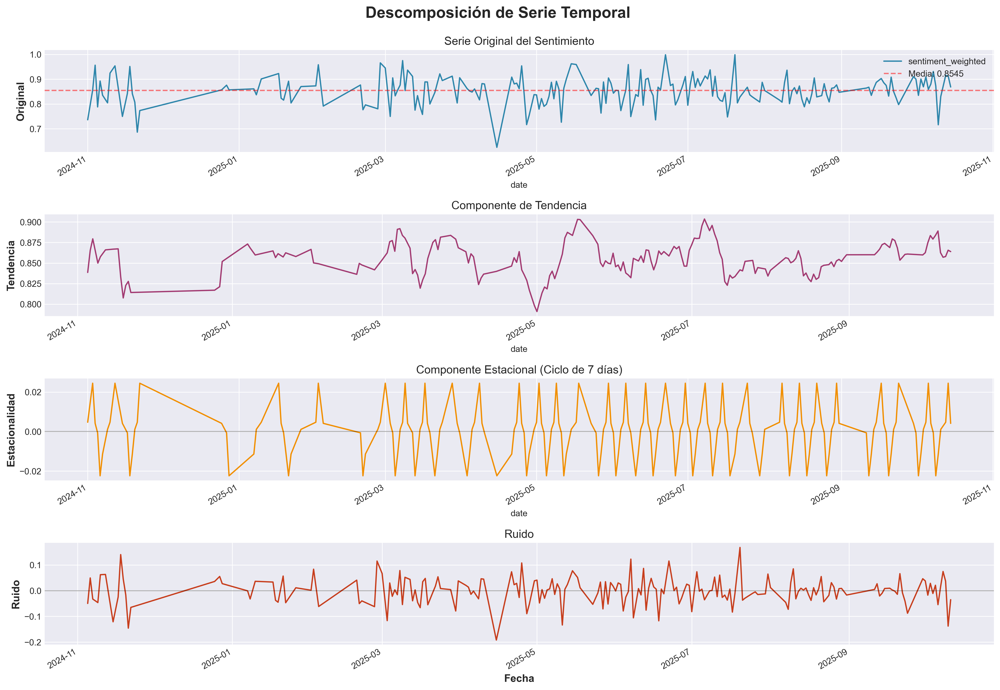
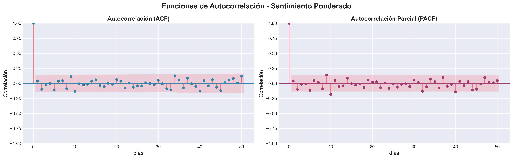
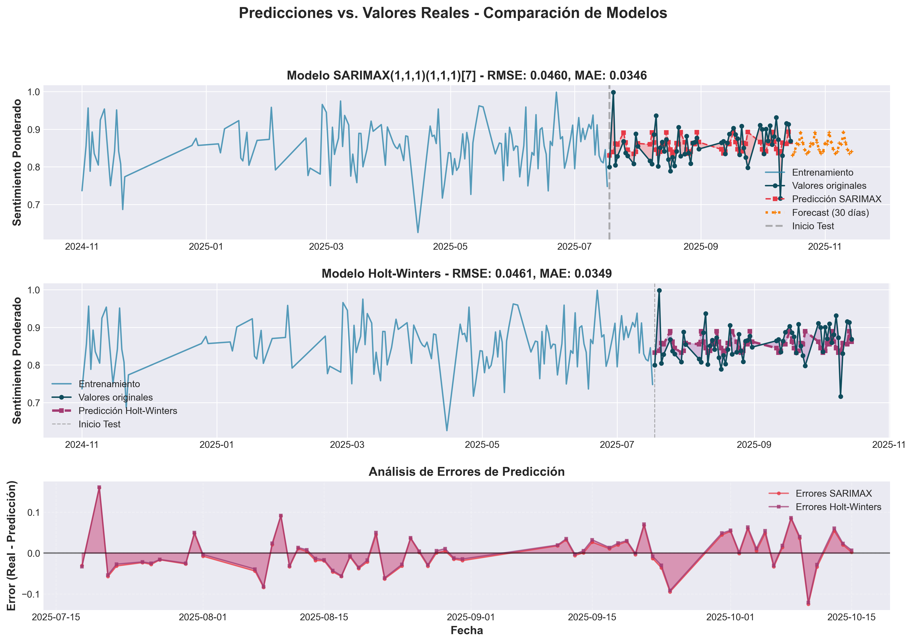
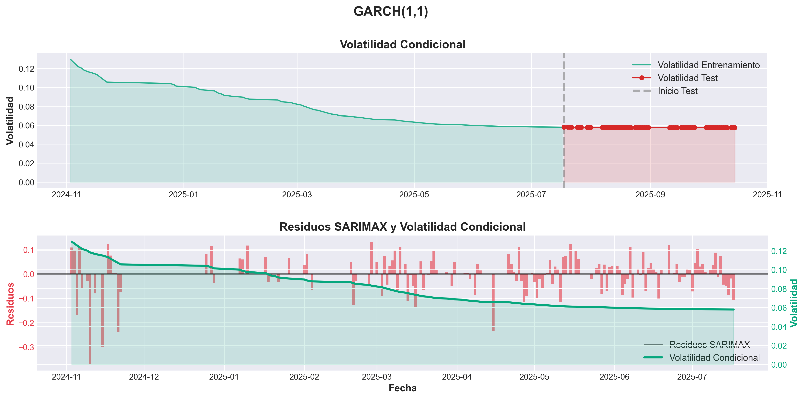
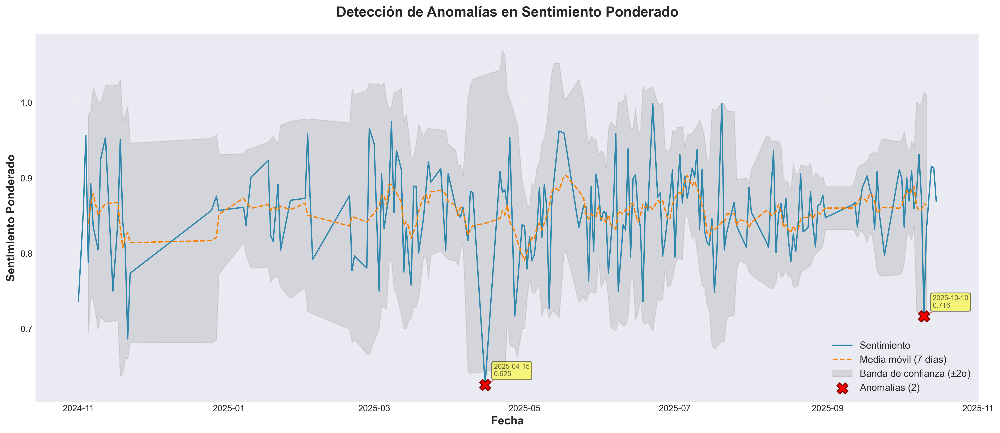

# Análisis Temporal de Sentimiento: Charlie Kirk

## 1. Hipótesis

> **"La animadversión hacia Charlie Kirk disminuye tras su muerte en septiembre de 2025"**

- **Variable dependiente**: `sentiment_weighted` (sentimiento ponderado, escala 0-1)
  - Valores cercanos a 1 = Sentimiento negativo (alta animadversión)
  - Valores cercanos a 0 = Sentimiento positovo (baja animadversión)
- **Variable independiente**: Evento temporal (muerte en septiembre 2025)
- **Período de análisis**: Noviembre 2024 - Octubre 2025 (1 año)
- **Predicción**: Si la hipótesis es correcta, se debería observar un decaímiento sostenido del sentimiento (valores más bajos) después de septiembre 2025


## 2. Descripción de Técnicas Aplicadas

### 2.1 Análisis Exploratorio de Datos (EDA)

#### Estadísticas Descriptivas
- **Análisis temporal**: Estadísticas semanales (media, desviación estándar, mínimo, máximo)
- **Identificación de períodos críticos**: Mejor y peor semana del período analizado
- **Análisis de variabilidad**: Coeficiente de variación y rango de valores

**Justificación**: Comprender la distribución y comportamiento general de la serie antes de aplicar técnicas avanzadas.

---

### 2.2 Descomposición de Series Temporales

#### Método: Descomposición Aditiva
```
Y(t) = T(t) + S(t) + R(t)
```
#### Configuración
- **Modelo**: Aditivo
- **Período estacional probado**: 7 días (estacionalidad semanal)

**Justificación**: Separar los componentes de la serie permite identificar tendencias subyacentes, patrones estacionales y anomalías de forma independiente.

---

### 2.3 Análisis de Autocorrelación

#### Funciones de Autocorrelación
- **ACF (Autocorrelation Function)**: Mide la correlación entre la serie y sus valores rezagados
- **PACF (Partial Autocorrelation Function)**: Mide la correlación directa eliminando efectos indirectos

#### Configuración
- **Rezagos analizados**: 50 días
- **Bandas de confianza**: 95%

**Justificación**: Determinar si existen patrones de dependencia temporal y validar la presencia de estacionalidad detectada en la descomposición.

---

### 2.4 Modelado Predictivo: SARIMAX(1,1,1)(1,1,1)[7]

#### División de Datos
- **Entrenamiento**: 80% de los datos (primeros 10 meses aprox.)
- **Prueba**: 20% de los datos (últimos 2 meses aprox.)

#### Métricas de Evaluación
- **RMSE (Root Mean Squared Error)**: Penaliza errores grandes
- **MAE (Mean Absolute Error)**: Error promedio absoluto
- **AIC/BIC**: Criterios de información para comparar modelos

**Justificación**: SARIMAX permite capturar tanto patrones temporales como estacionales, siendo una de las técnicas estándar más robustas para pronóstico de series temporales.

---

### 2.5 Suavizado Exponencial: Holt-Winters 
 
Misma división de datos y métricas de evaluación que SARIMAX.

**Justificación**: Método alternativo que pondera más los datos recientes, útil para comparar con SARIMAX y validar robustez de los resultados.

---

### 2.6 Modelado de volatilidad: GARCH(1,1)

Se usará los residuos del SARIMAX.

**Justificación**: Método para ver la volatilidad durante el tiempo, muy interesante para series temporales con poca dependencia temporal como la nuestra.

---

### 2.7 Detección de Anomalías: Bandas de Confianza con Desviación Estándar Móvil

**Criterio de anomalía**:
```
Anomalía si: valor > (media_móvil + 2σ) OR valor < (media_móvil - 2σ)
```

**Justificación**: Identificar eventos extremos o atípicos que podrían indicar cambios bruscos en el sentimiento relacionados con eventos específicos.


## 3. Resultados y Visualizaciones

### 3.1 Estadísticas Descriptivas Generales

| Métrica | Valor |
|---------|-------|
| **Período analizado** | 2024-11-01 a 2025-10-15 |
| **Total observaciones** | 349 días |
| **Media del sentimiento** | 0.8545 |
| **Desviación estándar** | 0.0580 |
| **Rango** | [0.6255, 0.9986] |

**Interpretación**: La serie presenta variabilidad moderada (~7%) con un sentimiento promedio de 0.85, indicando opinión mayormente negativas o neutral con respecto a la animadversión.

---

### 3.2 Descomposición Temporal



#### Resultados de la Descomposición

**A) Serie Original**
- **Media**: 0.8545
- **Picos máximos**: Julio 2025 (~1.0), Noviembre 2024 (~0.95)
- **Valle crítico**: Mayo 2025 (~0.65) - Anomalía más significativa
- **Variabilidad**: Alta, con fluctuaciones frecuentes

**B) Componente de Tendencia**
- **Valor inicial** (Nov 2024): 0.855
- **Valor final** (Oct 2025): 0.860
- **Cambio neto**: +0.005 (+0.6%)
- **Interpretación**: Tendencia prácticamente neutral con múltiples ciclos de subida/bajada

**C) Componente Estacional (Ciclo de 7 días)**
- **Amplitud**: ±0.02 (~2.3% de la media)
- **Patrón**: Regular pero estadísticamente débil
- **Contribución a variabilidad total**: <5%
- **Interpretación**: Existe un leve efecto día-de-semana, pero no es el factor dominante

**D) Componente Residual (Ruido)**
- **Rango**: [-0.20, +0.15]
- **Desviación estándar**: ~0.045
- **Contribución**: ~65-70% de la variabilidad total
- **Interpretación**: La serie está dominada por ruido/eventos aleatorios

---

### 3.3 Análisis de Autocorrelación



#### Resultados ACF/PACF

**Hallazgos clave**:
- Todos los lags están dentro de las bandas de confianza (excepto lag 0)
- No hay picos significativos que indicarían estacionalidad semanal
- Decaimiento rápido a valores cercanos a cero

**Interpretación**:
1. No hay autocorrelación significativa en la serie
2. El comportamiento se asemeja a ruido blanco con tendencia débil
3. Reafirma la interpretación de la estacionalidad observada en la descomposición, no es estadísitcamente significativo
5. Baja predictibilidad: Conocer valores pasados no ayuda a predecir valores futuros

**Conclusión ACF/PACF**: La serie tiene alta componente aleatoria. Los patrones temporales son débiles o inexistentes desde una perspectiva estadística rigurosa.

---

### 3.4 Resultados de Modelado

#### A) Modelo SARIMAX(1,1,1)(1,1,1)[7]

**Criterios de Información**:
- **AIC**: -323.82
- **BIC**: -309.60 

**Métricas de Evaluación**:

| Conjunto | RMSE | MAE |
|----------|------|-----|
| **Entrenamiento** | 0.0808 | 0.0594 |
| **Prueba** | 0.0460 | 0.0346 |

**Observaciones**: El error en prueba es menor que en entrenamiento, concluimos que no hay overfitting. Con los resultados obtenidos, podemos deducir que el modelo ha sido ajustado correctamente, dando valores de AIC y BIC bastante bajos. Además, las métricas indican errores considerablemente bajos.

**Pronóstico a 30 días**:
- **Sentimiento promedio predicho**: 0.8557
- **Consistente** con media histórica (0.8545)
- **Interpretación**: El modelo predice estabilidad futura

#### B) Modelo Holt-Winters

**Métricas de Evaluación**:

| Métrica | Valor |
|---------|-------|
| **RMSE** | 0.0461 |
| **MAE** | 0.0349 |

**Observación**: Se ha conseguido un resultado similar a SARIMAX, se hará su comparación en el siguiente punto.

#### Comparación de Modelos

**Mejor modelo**: SARIMAX (basado en RMSE y MAE más bajo en conjunto de test)



**Análisis**:
- Ambos modelos capturan razonablemente la tendencia general
- Mayor dificultad en capturar picos extremos (alta variabilidad)
- Las predicciones son conservadoras, cerca de la media
- Errores más grandes en períodos de alta volatilidad (octubre)

#### C) GARCH(1,1)

**Criterios de Información**:
- **AIC**: -334.68
- **BIC**: -322.83



**Observaciones**: Al igual que SARIMAX, conseguimos unos excelentes valores de AIC y BIC. Se muestra un claro decaimiento de la volatilidad, pasando de un riesgo alto (~0.12) a uno menor (~0.06). En la volatilidad del conjunto de test obtenemos una horizontal, que se valida con la std de 0.0001 y un rango de 0.0004 lo que significa que el riesgo se ha estabilizado. Además, vemos como el GARCH(1,1) es apropiado para modelar la volatilidad de los residuos del SARIMAX, ya que captura bien las variaciones en la magnitud de los errores a lo largo del tiempo.

---

### 3.5 Detección de Anomalías



**Anomalías identificadas**:
- **Total detectadas**: 2
- **Porcentaje**: 0.97% del total

**Anomalías más significativas**:

| Fecha | Valor | Esperado | Tipo |
|-------|-------|------|------------|
| 2025-04-15 | 0.6255 | 0.8399  | BAJA |
| 2025-10-10 | 0.7165 | 0.8656  | BAJA |

---

## 4. Discusión: Evaluación de la Hipótesis

#### Evidencia A Favor (débil)
1. **Incremento temporal**: Se observa mejora del sentimiento a principios de octubre. Pero vuelve a empeorar de nuevo.bre

#### Evidencia En Contra (fuerte)
1. **Desfase temporal crítico**: La mejora ocurre 2-3 semanas después del evento
   - Evento: Principios-mediados de septiembre
   - Mejora: Principios de octubre
   - Incompatible con causalidad directa e inmediata

2. **Efecto no sostenido**: Reversión rápida del sentimiento

3. **Alta componente de ruido**: >65% de variabilidad
   - Cambios observados consistentes con fluctuaciones aleatorias históricas
   - No se observa reducción de volatilidad post-evento

4. **ACF/PACF**: No hay cambio en estructura de autocorrelación
   - La serie sigue comportándose como ruido blanco
   - No hay evidencia de nuevo régimen temporal

5. **Ausencia de cambio estructural**: 
   - El componente de tendencia no muestra quiebre claro en septiembre
   - El valor final (oct) está en el rango histórico observado
   - No hay reducción sistemática de anomalías negativas

### Conclusión Final: **Los resultados refutan la hipótesis**


## 5. Limitaciones y Posibles Mejoras

1. **Período limitado de observación post-evento**
   - Solo ~1.5 meses después de septiembre
   - Insuficiente para evaluar efectos de largo plazo
   - **Mejora**: conseguir datos de meses posteriores (imposible actualmente porque el suceso fue muy reciente)

2. **Alta componente de ruido**
   - Dificulta distinguir señal de ruido
   - Limita capacidad de inferencia causal
   - **Mejora**: usar más fuentes (X, Facebook...) y segmentar (si fuera posible) por demografía (edad, ubicación, afiliación política...)

3. **Variable unidimensional**
   - Solo sentimiento agregado
   - No distingue entre tipos de sentimiento 
   - **Mejora**: diferenciar más sentimientos (tristeza, enojo, alivio, indiferencia...)
